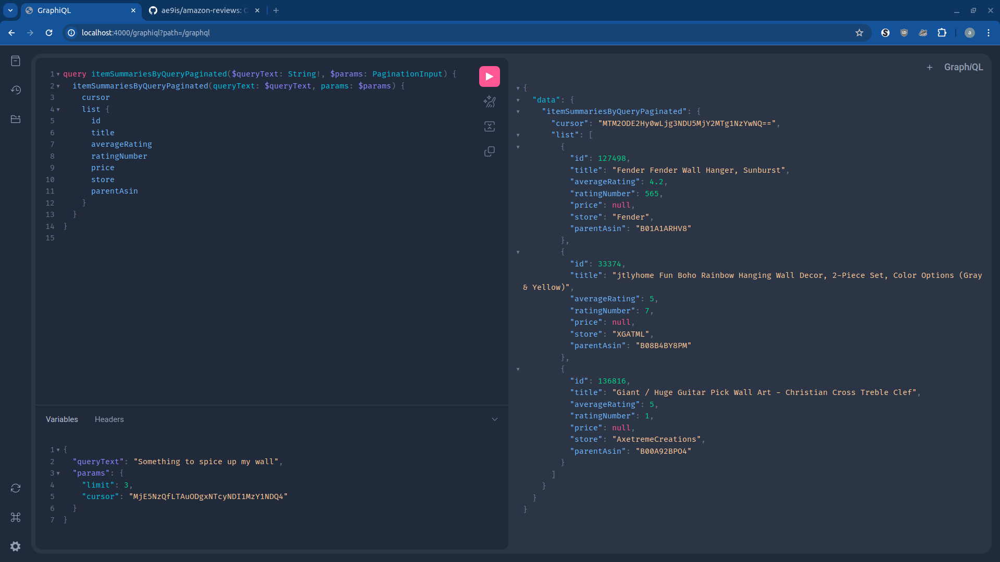
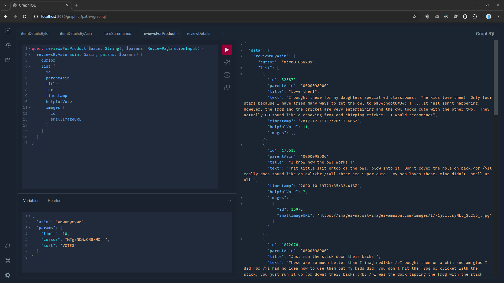

# amazon-reviews

Spring GraphQL API based on normalising the [Amazon Reviews 2023 dataset](https://github.com/hyp1231/AmazonReviews2023) in Postgres.

Also contains a Python API for running the [BLaIR model](https://github.com/hyp1231/AmazonReviews2023/tree/main/blair) for item recommendations.



## Setup

### Requirements

The project has been developed on Linux for Linux-based Docker image deployment. Your mileage may vary with other platforms.

Running the Python API requires CUDA 12.1, or some editing of the requirements in [pyproject.toml](pyproject.toml). The Python API also requires generation of some embeddings which are loaded into the database. This task effectively requires GPU-enabled PyTorch; it's very slow without.

### Environment variables

Setup loading .env variables: https://direnv.net/

```bash
direnv allow
```

### Python

Uses Python 3.12. To easily switch between versions of python, consider setting up [pyenv](https://github.com/pyenv/pyenv).

[PDM](https://github.com/pdm-project/pdm) is used for proper dependency resolution and convenience scripts.

```bash
pip install pipx
pipx install pdm
```

### Java

Uses Java 17+ with Gradle. Gradle is included in the project files already.

```
apt install openjdk-17-jdk
```

## Data 

See: https://huggingface.co/datasets/McAuley-Lab/Amazon-Reviews-2023/tree/main

The data needs to be downloaded and prepped for import into the database.

1. Download the following files to [data/import](data/import):
    - [Metadata (item info) file, Musical Instruments category only](https://huggingface.co/datasets/McAuley-Lab/Amazon-Reviews-2023/resolve/main/raw/meta_categories/meta_Musical_Instruments.jsonl?download=true)
    - [Reviews data file, Musical Instruments category only](https://huggingface.co/datasets/McAuley-Lab/Amazon-Reviews-2023/resolve/main/raw/review_categories/Musical_Instruments.jsonl?download=true)

2. Then run the following task:

    ```bash
    make parse
    ```

3. For the item recommendations API, some item metadata needs to be fed through a model to generate embeddings. This takes a while and is interruptible:

    ```bash
    make embeddings
    ```

*Note: Feel free to download, merge, and parse the data for **all** of the categories—but it's a lot bigger!*

## Run

To run the Spring and Python APIs and Postgres database via Docker:

```bash
direnv allow
make docker-build
docker compose up
```

Open http://localhost:4000/graphiql?path=/graphql

(Optional) You can also directly run the Spring API at the same time with:

```bash
make run
```
Open http://localhost:8080/graphiql?path=/graphql



## Test

With the Postgres database and APIs started:

```bash
make test
```

## Database

### Migrations

Bring up the database instance with Docker and then:

```bash
# Create and load tables
bash docker-db-up.sh

# Dump and drop tables
bash docker-db-down.sh
```

### CLI

To get a shell to the running Postgres instance:

```bash
make docker-bash-db
postgres@...:/$ psql reviews
reviews=# \d
```
